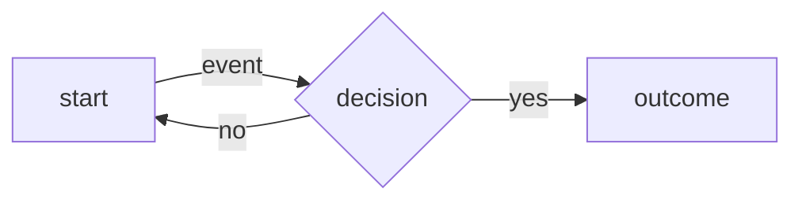

# <Concept name>

**Slug:** `<slug>` · **Category:** `<category>` · **Status:** used | considered

> **TL;DR:** <one sentence a tired human could read and get the gist.>

## The analogy
<A short everyday analogy that makes the idea click before any jargon. One or two sentences.>

## What it is
<Plain-language explanation and the mental model to hold. Cite sources inline as you
explain — e.g. "connection pooling reuses a bounded set of open connections ([PostgreSQL
docs][1])" — so every claim is traceable. Use `[n]` markers that resolve in Resources below.>

<!-- Optional — include a diagram ONLY when the concept is genuinely visual (a flow, a
sequence, a structure, a before/after). Delete this block otherwise. GitHub renders Mermaid
natively, so it shows as a picture in the browser with no build step. -->

## Why it matters
<When to reach for it; the problem it solves. Cite inline where a claim leans on a source.>

> **Key insight:** <the one thing to remember if you forget everything else.>

## Example
<A concrete example — code or scenario. Tie it to the session it came from so it sticks.>

## Tradeoffs & pitfalls
<Alternatives and when NOT to use it. Put the sharpest warning in a callout:>

> ⚠️ **Pitfall:** <the mistake people actually make.>

## Resources
<The sources cited inline above, resolved. Verify each points where you think.>
[1]: <url> "<title> — one line on why this one"

## Recall prompts
_Answer these from memory later — retrieval beats rereading._
1. <question that forces the core mental model>
2. <question about when to use / when NOT to>
3. <question tying it to a concrete situation>

## Session appearances
- YYYY-MM-DD — [<session>](/sessions/YYYY-Www/YYYY-MM-DD-<topic>.md): <what happened with it>

## My notes & links
_Yours to fill in — the skill leaves this untouched._
- [ ] Read the linked resources
- [ ] Try it in a real task
- [ ] Link my own notes here:
